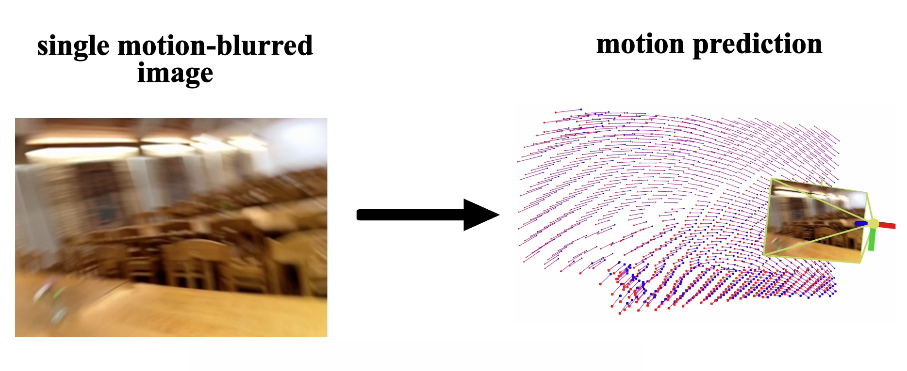

# Image as an IMU: Estimating Camera Motion from a Single Motion-Blurred Image



Official implementation of *Image as an IMU: Estimating Camera Motion from a Single Motion-Blurred Image*, ICCV 2025 (Oral).

[[arXiv](https://arxiv.org/abs/2503.17358)] [[Webpage](https://jerredchen.github.io/image-as-imu/)]

**[PIXL, University of Oxford](https://pixl.cs.ox.ac.uk/)**

[Jerred Chen](https://jerredchen.github.io/), [Ronald Clark](https://ronnie-clark.co.uk/)

```bibtex
@inproceedings{chen2025imageimu,
  title={Image as an IMU: Estimating Camera Motion from a Single Motion-Blurred Image},
  author={Chen, Jerred and Clark, Ronald},
  booktitle={International Conference of Computer Vision (ICCV)},
  year={2025}
}
```

## Getting Started

First, create a new conda environment.
```bash
conda create -n image-as-imu python=3.10
conda activate image-as-imu
```

Then, clone the repo and install the dependencies.
```bash
git clone https://github.com/jerredchen/image-as-an-imu.git
cd image-as-an-imu
pip install torch==2.6.0 torchvision==0.21.0 --index-url https://download.pytorch.org/whl/cu118
pip install -r requirements.txt
```

Finally, install the `iaai` module.
```bash
pip install -e .
```

Download the model weights:

| **Backbone** | **Checkpoint** |
|--------------|---------------------------------------------------------------------------------------|
|    SegNeXt   |  [Download](https://drive.google.com/drive/folders/1TM43bWK1v17SRWcifzS9M6VyKuztgfXW) |


To run a minimal example, we provide `run.py` which takes in a single motion-blurred image and estimates the velocity, given the known focal length and exposure time.

```python
import torch
from PIL import Image
from iaai.model import Blur2PoseSegNeXtBackbone
from iaai.funcs import compute_single_image_velocity

model = Blur2PoseSegNeXtBackbone(device="cuda")
state_dict = torch.load("/path/to/model_ckpt.pth")
model.load_state_dict(state_dict, strict=True)
model.eval().cuda()

demo_img = Image.open("./assets/demo.jpg")
data = {"image": demo_img, "fx": 1433.1024, "fy": 1433.1024}
out = model.infer(data) # out is a dict with keys "flow_field", "depth", "pose", "residual"
# Optionally apply a transformation to the rotation matrix
# This transforms the rotation to match the iPhone gyroscope's coordinate system
opencv2gyro_tf = torch.tensor([[ 0, -1,  0],
                               [-1,  0,  0],
                               [ 0,  0, -1]]).float()
rot_vel, trans_vel = compute_single_image_velocity(
    out["pose"].squeeze(),
    exposure_time_s=0.01,
    M=opencv2gyro_tf,
    device="cuda")

# Note that the velocity has sign ambiguity if there is only one image
print(f"Rotational velocity: {rot_vel.cpu().numpy()}")
print(f"Translational velocity: {trans_vel.cpu().numpy()}")
```

## StrayScanner Example

We show how to use our model on a custom [StrayScanner](https://apps.apple.com/us/app/stray-scanner/id1557051662) recorded sequence, which you can download on iPhone 12 Pro or later Pro models and iPad 2020 Pro or later Pro models. After recording and downloading the sequence, you can process it using `process_strayscanner_seq.py` and specifying your arguments in `process_strayscanner_cfg.yaml`. Then, run `run_custom_strayscanner_seq.py` given your sequence path in `run_strayscanner_cfg.yaml`.

Note that the StrayScanner app does not currently support accessing the exposure time of the camera. However, in normal lighting conditions you may assume that the exposure time is typically around 0.01 seconds.

## Evaluation

We include scripts for evaluating all of our baselines. To evaluate the baselines, follow the installation instructions for [hloc](https://github.com/cvg/Hierarchical-Localization), [MASt3R](https://github.com/naver/mast3r), [DROID-SLAM](https://github.com/princeton-vl/DROID-SLAM), as well as [evo](https://github.com/MichaelGrupp/evo). Then, run the respective evaluation script given the specified sequence path in the config. In each config, you may optionally save the velocity outputs of a baseline to be saved to the sequence directory, which can be reused instead of rerunning the method. Download the test sequences used in our paper evaluation [here](https://drive.google.com/drive/folders/1Yqwokv6gL5AmtMBwUkQoIt1a9AE2sSK9). We slightly modified the StrayScanner app to access the exposure time through the ARKit API.

## Synthetic Data Generation

We provide the script for generating the synthetically rendered motion-blurred images. To run this, you will need to download [ScanNet++](https://kaldir.vc.in.tum.de/scannetpp), which will require submitting an application. You will also need to follow the installation instructions for [RIFE](https://github.com/hzwer/ECCV2022-RIFE) and [PromptDA](https://github.com/DepthAnything/PromptDA). Then, run `synth_data_gen.py` with the config `synth_data_gen_cfg.yaml`. This will generate a CSV file with the paths to load the motion-blurred images, flows, depths, as well as the relative camera pose across the image.

## Training

If you wish to train the model from scratch, please also see the synthetic data generation instructions above. You will need to also download the ImageNet-pretrained SegNeXt weights `mscan_b.pth` from [here](https://cloud.tsinghua.edu.cn/d/c15b25a6745946618462/).

To train the model, run `train.py` with the desired arguments/hyperparameters in `train/configs/train_cfg.yaml`. As mentioned in our paper, we train the model in three stages:
- We first train the model without pose supervision and only train the flow and depth decoders by setting `MODEL.POSE_HEAD.SUPERVISION=false`.
- After the flow and depth predictions are reasonable, we further train the pose head with `MODEL.POSE_HEAD.SUPERVISION=true`.
- Finally, we finetune with real-world images with `MODEL.POSE_HEAD.SUPERVISION=true`, `TRAINING.POSE_ONLY=true` and `TRAINING.USE_PSEUDO_GT=true`, which prevent the flow and depth predictions from deviating too far from the original outputs. Run `generate_pseudo_gt.py` to generate the pseudo ground-truth labels.

We provide the hyperparameters that we use for all three stages in separate files. However, we only use the file `train/configs/train_cfg.yaml` when actually training the model, so the desired hyperparameters can be changed in `train_cfg.yaml` or [in the command line](https://hydra.cc/docs/advanced/override_grammar/basic/).

## TODOs

- [x] Release the evaluation code
- [x] Release the training code
- [x] Release the synthetic data generation code
- [ ] Release the real-world finetuning dataset